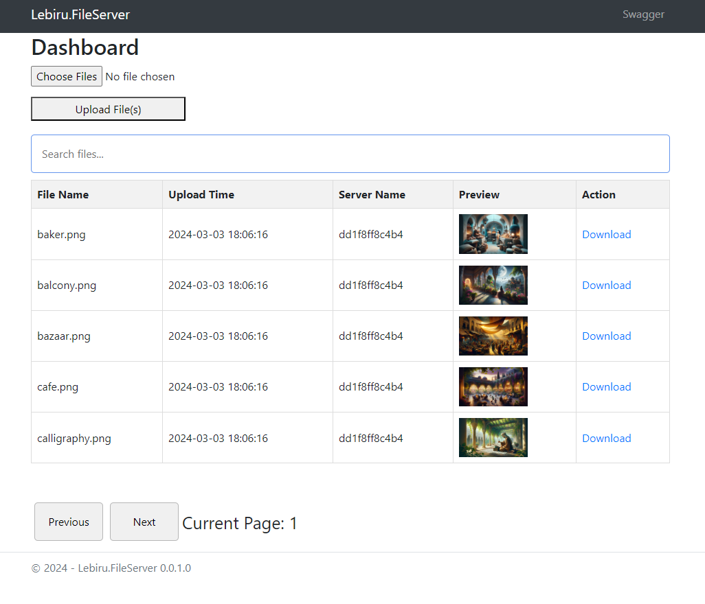

# Lebiru.FileService

Lebiru.FileService is a simple ASP.NET Core application that allows users to upload, download, and manage files. It provides a RESTful API for file operations and includes a web interface for easy interaction.

## Features

- **Secure Authentication**: 🔒 Admin authentication required to access all features and endpoints.
- **File Upload**: Users can upload files to the server.
- **File Download**: Users can download files from the server.
- **File Printing**: 🖨️ Users can easily print files directly from the web interface.
- **File Rename**: 🔄 Users can rename their uploaded files while preserving file extensions.
- **File Copy**: 📋 Users can create copies of files with automatic naming (adds "Copy" suffix).
- **Multi-File Download to Zip**: Users can download multiple files into a zip from the server. (@alfcanres)
- **File Listing**: Users can view a list of uploaded files along with their upload times.
- **Image Preview**: 🖼️ Image files are displayed with a preview in the web interface.
- **Text File Preview**: 📄 Text files show the first 100 characters as a preview in the web interface.
- **File Expiry**: ⏳ Set expiration times for uploaded files (1 minute, 1 hour, 1 day, 1 week, or never).
- **Background Jobs**: 🔄 Automated cleanup of expired files using Hangfire.
- **Job Monitoring**: 📊 Hangfire dashboard for monitoring file cleanup and expiry jobs.
- **Console Logging**: 📝 Detailed logging of file deletions and cleanup operations.
- **Dark Mode**: 🌙 Toggle between light and dark themes for better visibility.
- **User Management**: 👥 Multi-user support with different roles (Admin/Contributor/Viewer).
- **File Ownership**: 📋 Track file ownership and permissions per user.
- **API Metrics**: 📈 Track usage metrics (uploads, downloads, deletions) with last update time.
- **Data Persistence**: 💾 All data (user info, metrics, file info) persisted in app-data directory.
- **Bulk Operations**: 🗑️ Support for operations like "Delete All Files" with proper cleanup.

## Technologies Used

- **ASP.NET Core**: Backend framework for building web applications and APIs.
- **C#**: Programming language used in conjunction with ASP.NET Core.
- **HTML/CSS/JavaScript**: Frontend technologies for building the web interface.
- **Swagger**: API documentation tool used to document the RESTful API endpoints.
- **OpenShift**: Platform used for horizontal scaling and deployment of the application.
- **OpenTelemetry**: Unified data telemetry for microservices
- **Jaeger**: Open source, distributed tracing platform
- **Hangfire**: Background job processing for scheduled tasks
- **Hangfire.Console**: Enhanced logging for background jobs

## Getting Started

To run the application locally, follow these steps:

1. **Clone this repository** to your local machine.
2. **Open the solution** in Visual Studio or your preferred IDE.
3. **Build the solution** to restore dependencies.
4. **Run the application** using the IDE's built-in tools or command-line interface.
5. **Access the application** through the provided URL (e.g., `http://localhost:port`).

## Testing

The project includes a comprehensive test suite. To run the tests and generate a coverage report:

1. Run the tests with coverage:
```powershell
dotnet test --collect:"XPlat Code Coverage"
```

2. Generate an HTML report (replace the coverage GUID with your actual generated GUID):
```powershell
cd Lebiru.FileService.Tests
reportgenerator -reports:"TestResults\{guid}\coverage.cobertura.xml" -targetdir:"coveragereport" -reporttypes:Html
```

The HTML report will be generated in the `Lebiru.FileService.Tests\coveragereport` directory. Open `index.html` in your browser to view a detailed breakdown of code coverage across the project.

## API Documentation

The API documentation is available through Swagger. Once the application is running, you can access the Swagger UI by navigating to `/swagger` in your browser.

## Usage

### Authentication and Users

- The application requires authentication for all features
- Three user roles are available:
  - **Admin**: Full access to all features including user management
  - **Contributor**: Can upload and manage files
  - **Viewer**: Can view and download files
- Default users are created at first startup with generated passwords:
  - `admin` (Admin role)
  - `contributor` (Contributor role)
  - `viewer` (Viewer role)
- Passwords are displayed in the console at first startup
- All API endpoints and web interfaces require authentication
- Current user is displayed in the navigation bar

### File Operations

- **Uploading Files**: 
  - Use the web interface or send a POST request to `/File/CreateDoc` with the file attached as form data
  - Set expiry time during upload (1 minute, 1 hour, 1 day, 1 week, or never)
  - Files are automatically deleted when they expire
  - Files are associated with the uploading user
- **Downloading Files**: 
  - Click the download link in the web interface or send a GET request to `/File/DownloadFile?filename=your_file_name`
  - Batch download multiple files as a ZIP archive
  - Downloads are tracked in API metrics
- **Printing Files**:
  - Use the Print button in the file actions menu to open the browser's print dialog
  - Optimized print layout for different file types (images, PDFs, text)
  - Print directly from the application without downloading files first
- **Renaming Files**:
  - Click the Rename button in the file actions menu to rename files
  - File extension is automatically preserved to maintain file type
  - Only file owners and admins can rename files
  - All references to the file are updated automatically (ownership records, file metadata)
- **Copying Files**:
  - Use the Make Copy button in the file actions menu to duplicate files
  - Automatically appends " Copy" to the filename (or " Copy N" if needed for uniqueness)
  - Creates a new file with same content and attributes as the original
  - New copy is assigned to the user who created it
  - File references are automatically updated (ownership records, file metadata)
- **File Management**:
  - View list of all uploaded files with upload times and expiry status
  - Rename files while preserving file extension and ownership
  - See remaining time before file expiry
  - Automatic cleanup of expired files
  - Monitor file operations through Hangfire dashboard at `/hangfire`
  - "Delete All Files" feature for admins with proper cleanup of all related data
- **User Interface**:
  - Image previews for supported formats (PNG, JPG, GIF, BMP)
  - Click previews to view full-size images
  - Toggle dark mode for comfortable viewing
  - Search and filter files
  - Sort files by various criteria (name, size, upload time, expiry)
  - API metrics dashboard showing usage statistics
  - Server space usage monitoring

## Deployment

The application can be deployed to OpenShift for horizontal scaling and high availability. Configure your OpenShift environment and deploy the application using the provided deployment configurations.

## Contributing

Contributions are welcome! If you have any ideas, improvements, or bug fixes, feel free to open an issue or submit a pull request.

## License

This project is licensed under the MIT License - see the [LICENSE](LICENSE) file for details.

