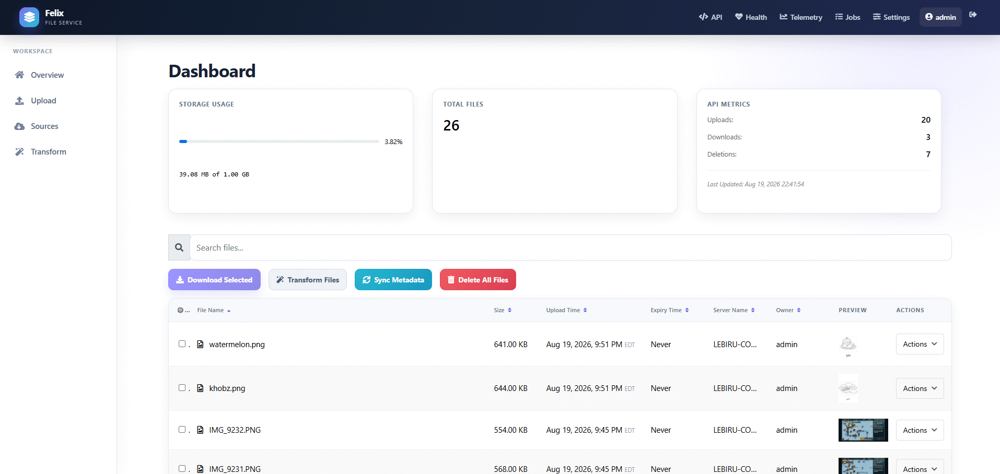

# Lebiru.FileService

Lebiru.FileService is a simple ASP.NET Core application that allows users to upload, download, and manage files. It provides a RESTful API for file operations and includes a web interface for easy interaction.

## Features

- **Secure Authentication**: 🔒 Admin authentication required to access all features and endpoints.
- **File Upload**: Users can upload files to the server.
- **File Download**: Users can download files from the server.
- **File Printing**: 🖨️ Users can easily print files directly from the web interface.
- **File Rename**: 🔄 Users can rename their uploaded files while preserving file extensions.
- **File Copy**: 📋 Users can create copies of files with automatic naming (adds "Copy" suffix).
- **File Checksums**: 🔐 Users can copy SHA-256 checksums of files to the clipboard for verification.
- **Multi-File Download to Zip**: Users can download multiple files into a zip from the server. (@alfcanres)
- **File Listing**: Users can view a list of uploaded files along with their upload times.
- **Image Preview**: 🖼️ Image files are displayed with a preview in the web interface.
- **Text File Preview**: 📄 Text files show the first 100 characters as a preview in the web interface.
- **File Type Icons**: 📂 Files are displayed with appropriate Font Awesome icons based on file type.
- **Local Time Display**: 🕒 Upload times automatically displayed in user's local timezone with AM/PM format.
- **File Expiry**: ⏳ Set expiration times for uploaded files (1 minute, 1 hour, 1 day, 1 week, or never).
- **Sidebar Navigation**: 📋 Permanent sidebar navigation for easy access to all application features.
- **MIME Type Validation**: 🛡️ Security feature that validates file MIME types during upload to prevent malicious files.
- **Enhanced Upload Interface**: 📤 Dedicated upload page with drag-and-drop functionality for easier file uploads.
- **Background Jobs**: 🔄 Automated cleanup of expired files using Hangfire.
- **Job Monitoring**: 📊 Hangfire dashboard for monitoring file cleanup and expiry jobs.
- **Console Logging**: 📝 Detailed logging of file deletions and cleanup operations.
- **Dark Mode**: 🌙 Toggle between light and dark themes for better visibility.
- **User Management**: 👥 Multi-user support with different roles (Admin/Contributor/Viewer).
- **File Ownership**: 📋 Track file ownership and permissions per user.
- **API Metrics**: 📈 Track usage metrics (uploads, downloads, deletions) with last update time.
- **Data Persistence**: 💾 All data (user info, metrics, file info) persisted in app-data directory.
- **Bulk Operations**: 🗑️ Support for operations like "Delete All Files" with proper cleanup.
- **File Sharing**: 🔗 Share button to easily copy file viewing links to clipboard.
- **In-Browser Text Viewing**: 📄 Text files displayed in browser with syntax highlighting and line numbers.
- **External File Fetching**: 🌐 Fetch files from external sources (FTP, SFTP, HTTP/HTTPS, WebDAV, Network Shares).
- **Secure Web Page Ingestion**: 🌍 Save public HTML/XHTML pages as owned files in root or a selected virtual directory.
- **File View Analytics**: 👁️ Track authorized dedicated-page views, last-viewed time, and bounded daily trends for every managed file.
- **File Transformation**: 🔄 Transform files using regex patterns to extract and process content.

## Technologies Used

- **ASP.NET Core**: Backend framework for building web applications and APIs.
- **C#**: Programming language used in conjunction with ASP.NET Core.
- **HTML/CSS/JavaScript**: Frontend technologies for building the web interface.
- **Swagger**: API documentation tool used to document the RESTful API endpoints.

- **Hangfire**: Background job processing for scheduled tasks
- **Hangfire.Console**: Enhanced logging for background jobs

## Getting Started

To run the application locally, follow these steps:

1. **Clone this repository** to your local machine.
2. **Install the .NET 10 SDK** (`10.0.400` or a newer servicing patch).
3. **Open the solution** in Visual Studio or your preferred IDE.
4. **Build the solution** to restore dependencies.
5. **Run the application** using the IDE's built-in tools or command-line interface.
6. **Access the application** through the provided URL (e.g., `http://localhost:port`).

For development with automatic rebuilds, run:

```powershell
dotnet watch --project app run
```

## Testing

The project includes a comprehensive test suite. To run the tests and generate a coverage report:

1. Run the tests with coverage:
```powershell
dotnet test --collect:"XPlat Code Coverage"
```

2. Generate an HTML report (replace the coverage GUID with your actual generated GUID):
```powershell
cd Lebiru.FileService.Tests
reportgenerator -reports:"TestResults\{guid}\coverage.cobertura.xml" -targetdir:"coveragereport" -reporttypes:Html
```

The HTML report will be generated in the `Lebiru.FileService.Tests\coveragereport` directory. Open `index.html` in your browser to view a detailed breakdown of code coverage across the project.

## API Documentation

The API documentation is available through Swagger. Once the application is running, you can access the Swagger UI by navigating to `/swagger` in your browser.

## Usage

### Authentication and Users

- The application requires authentication for all features
- Three user roles are available:
  - **Admin**: Full access to all features including user management
  - **Contributor**: Can upload and manage files
  - **Viewer**: Can view and download files
- On first startup, set `LEBIRU_BOOTSTRAP_ADMIN_PASSWORD` to a strong password of at least 14 characters. The application creates only the `admin` account and never writes the password to logs.
- Remove `LEBIRU_BOOTSTRAP_ADMIN_PASSWORD` from the environment after the administrator has been created.
- Existing plaintext password records are migrated once to salted password hashes.
- All API endpoints and web interfaces require authentication
- Current user is displayed in the navigation bar

### Security Features

- **Authentication**: All access requires valid credentials with appropriate role permissions
- **MIME Type Validation**: Both client-side and server-side validation prevents upload of potentially dangerous files
- **File Extension Filtering**: Blocks known dangerous file extensions (.exe, .bat, .cmd, etc.)

### External File Fetching

The application supports fetching files from various external sources:

- **Multiple Source Types**: Connect to FTP, SFTP, HTTP/HTTPS, WebDAV, and Network Shares
- **Scheduled Fetching**: Configure automatic fetching at regular intervals
- **Connection Testing**: Test connections before saving fetch sources
- **Fetch Activity Tracking**: Monitor fetch operations with detailed logs
- **File Filtering**: Specify patterns to fetch only relevant files
- **Post-Fetch Actions**: Optionally delete files from source after successful fetch
- **Role-Based Access**: Different permissions for Admin, Contributor, and Viewer roles
- **File Ownership**: Users can only modify or delete their own files unless they have Admin privileges

#### Web Page sources

Choose **Fetch Source → Add Fetch Source → Web Page**, enter a public HTTP or HTTPS URL, and select an optional destination directory. Running the source stores the response body unchanged as a normal owned `.html`, `.htm`, or `.xhtml` file. The same operation is available to Admin and Contributor users through `POST /api/fetch/web-page`:

```json
{
  "url": "https://example.com/article",
  "directoryId": null
}
```

`WebPageFetch` settings control the feature flag, total timeout, maximum response bytes (5 MB by default), redirect limit, per-user concurrency, and requests per minute. Each destination and redirect is DNS-resolved and blocked when any answer is local, private, link-local, multicast, reserved, a cloud metadata address, or otherwise non-public. Connections are pinned to validated addresses to mitigate DNS rebinding. Only successful HTML/XHTML responses are finalized; timeout, cancellation, validation, and storage failures remove temporary files.

### File Transformation

The application provides ETL (Extract, Transform, Load) capabilities for processing files:

- **Regex Parsing**: Extract specific content from files using regular expressions
- **File Pattern Matching**: Target specific files for transformation using wildcards
- **Scheduled Transformations**: Automatically run transformations at configured intervals
- **Transform Activity Tracking**: Monitor all transform operations with detailed logs
- **Test Feature**: Test transformations on actual files before saving
- **Output Files**: Transformed content saved as new files for further processing
- **Data Validation**: Input validation throughout the application prevents injection attacks

### File Operations

#### File view metrics

The **View File** action opens the authorized dedicated page at `/files/{fileId}`. A view is counted only after the current owner or an administrator is authorized and the physical file is available. Downloads, thumbnails, directory listings, ZIP generation, raw previews, and `GET /api/files/{fileId}` metadata requests do not count as views.

Each file stores a 64-bit `ViewCount`, nullable UTC `LastViewedAt`, and up to 366 daily rollups. Historical JSON metadata uses the non-destructive `FileViewsV1` schema-default migration: missing fields deserialize as zero, null, and an empty series. Rename and virtual-directory moves retain the same stable file ID and analytics.

`FileViews.Enabled` is the operational kill switch and `FileViews.DeduplicationWindowSeconds` defaults to 300 seconds. Deduplication uses a bounded, process-local in-memory key composed from file ID and authenticated viewer; therefore separate application instances may each count one view during the same window. Analytics persistence failures are logged and metered but do not block an otherwise authorized page.

The authorized read-only response from `GET /api/files/{fileId}` includes `viewCount`, `lastViewedAt`, and `viewSeries`. OpenTelemetry exports `fileservice_file_views_total`, `fileservice_file_view_deduplicated_total`, and `fileservice_file_view_record_failures_total` without per-file or per-user labels.

- **Uploading Files**: 
  - Use the dedicated upload page with drag-and-drop functionality or the file selector
  - Real-time MIME type validation secures against malicious file uploads
  - Visual feedback shows validation status for each file being uploaded
  - Set expiry time during upload (1 minute, 1 hour, 1 day, 1 week, or never)
  - Files are automatically deleted when they expire
  - Files are associated with the uploading user
  - Progress indicator shows upload status
- **Downloading Files**: 
  - Click the download link in the web interface or send a GET request to `/File/DownloadFile?filename=your_file_name`
  - Batch download multiple files as a ZIP archive
  - Downloads are tracked in API metrics
- **Printing Files**:
  - Use the Print button in the file actions menu to open the browser's print dialog
  - Optimized print layout for different file types (images, PDFs, text)
  - Print directly from the application without downloading files first
- **Renaming Files**:
  - Click the Rename button in the file actions menu to rename files
  - File extension is automatically preserved to maintain file type
  - Only file owners and admins can rename files
  - All references to the file are updated automatically (ownership records, file metadata)
- **Copying Files**:
  - Use the Make Copy button in the file actions menu to duplicate files
  - Automatically appends " Copy" to the filename (or " Copy N" if needed for uniqueness)
  - Creates a new file with same content and attributes as the original
  - New copy is assigned to the user who created it
  - File references are automatically updated (ownership records, file metadata)
- **File Checksums**:
  - Click the Copy Checksum button in the file actions menu to copy the SHA-256 hash to clipboard
  - Verify file integrity and authenticity by comparing checksums
  - Success notification displayed when checksum is copied
  - Access via API endpoint at `/File/Checksum?filename=your_file_name`
- **File Management**:
  - View list of all uploaded files with upload times and expiry status
  - Rename files while preserving file extension and ownership
  - See remaining time before file expiry
  - Automatic cleanup of expired files
  - Share files easily by copying view links to clipboard
  - Monitor file operations through Hangfire dashboard at `/hangfire`
  - "Delete All Files" feature for admins with proper cleanup of all related data
  - View text files directly in browser with syntax highlighting and line numbers
- **User Interface**:
  - Permanent sidebar navigation for quick access to all app features
  - Image previews for supported formats (PNG, JPG, GIF, BMP)
  - Click previews to view full-size images
  - Toggle dark mode for comfortable viewing
  - Search and filter files
  - Sort files by various criteria (name, size, upload time, expiry)
  - API metrics dashboard showing usage statistics
  - Server space usage monitoring
  - Real-time file validation feedback during uploads
  - Custom error pages that maintain consistent application layout
  - Share files easily by copying viewing links to clipboard
  - In-browser text file viewing with syntax highlighting and line numbers

## Deployment

### Virtual directories

Felix stores directories as logical metadata in `app-data/directories.json`. File bytes remain in the existing `uploads` object store; moving a file or directory updates metadata only. Existing `fileInfo.json` records are upgraded automatically by the non-destructive `VirtualDirectoriesV1` metadata migration: each receives a stable `Id`, while the absent nullable `DirectoryId` remains `null` and therefore represents root.

The authenticated directory API includes:

| Method | Endpoint | Behavior |
| --- | --- | --- |
| `POST` | `/api/directories` | Create a root or nested directory. |
| `GET` | `/api/directories/root/contents` | List the user's root files, directories, and root breadcrumb. |
| `GET` | `/api/directories/{id}/contents` | List immediate contents and ordered breadcrumbs. |
| `PATCH` | `/api/directories/{id}` | Rename and/or move a directory; explicit `parentDirectoryId: null` moves it to root. |
| `DELETE` | `/api/directories/{id}` | Delete an empty directory; non-empty directories return `409 Conflict`. |
| `GET` | `/api/directories/{id}/archive` | Download the owned directory tree as a ZIP archive. |
| `PATCH` | `/api/files/{fileId}/directory` | Move an owned file; `directoryId: null` moves it to root. |
| `POST` | `/File/Upload` | Existing upload endpoint with an optional multipart `directoryId`. |

Directory IDs are never treated as authorization. Every directory, target parent, file move, listing, breadcrumb traversal, deletion, and archive query is scoped to the authenticated username. Directory names are logical labels and need not be unique. ZIP entry paths are separately normalized to prevent traversal. ZIP generation is disk-spooled and streams each stored object through a fixed-size buffer, so the whole archive never resides in application memory.

The dashboard provides the same functionality visually: folder cards and breadcrumbs navigate the hierarchy, the toolbar creates and manages folders, each owned file has a **Move to folder** action, and **Upload here** opens the upload page with the current destination selected. The upload page can also target any owned nested folder directly.

### OpenTelemetry

The application exports structured logs, ASP.NET Core request traces, outbound HTTP traces, runtime metrics, and custom request/error/latency metrics. The built-in dashboard is available at `/Telemetry` after login.

For the full local debugging experience, start the Aspire AppHost:

```bash
dotnet run --project app/Lebiru.FileService.AppHost
```

The command launches Felix File Service at `http://localhost:3002` and opens the authenticated Aspire dashboard at `http://localhost:18888`. Use its Resources, Structured Logs, Traces, and Metrics pages to inspect the running application. The dashboard login URL and temporary browser token are printed in the terminal. Standalone application startup remains available at `http://localhost:3000`, so both modes can run side by side.

When launched through the AppHost, administrators also see an **Aspire** link in the Felix navigation bar. The link targets the role-protected `/Aspire` endpoint; non-administrators cannot use that endpoint. `Aspire:DashboardUrl` is empty by default so a normal application deployment does not expose a dead or unintended dashboard link.

Aspire injects its authenticated OTLP endpoint automatically. Traces and structured logs are exported within about one second, and metrics every five seconds. Open the Felix endpoint from the Resources page or browse `http://localhost:3002/health/live` to generate an initial request trace.

By default telemetry is written through the console exporter. To send OTLP data to an OpenTelemetry Collector or compatible backend, set an endpoint and optionally disable console output:

```bash
OTEL_EXPORTER_OTLP_ENDPOINT=http://otel-collector:4317
OpenTelemetry__UseConsoleExporter=false
```

The service name defaults to `Lebiru.FileService` and can be changed with `OpenTelemetry__ServiceName` or the standard `OTEL_SERVICE_NAME` environment variable. Aspire supplies its OTLP endpoint and authentication headers automatically.

For a production dashboard, set `Aspire__DashboardUrl` to its public HTTPS URL and configure the standalone Aspire dashboard to use your OpenID Connect provider with an administrator claim. Do not enable anonymous dashboard access. The relevant dashboard container settings are:

```bash
Aspire__DashboardUrl=https://aspire.example.com
Dashboard__Frontend__AuthMode=OpenIdConnect
Dashboard__Frontend__OpenIdConnect__RequiredClaimType=role
Dashboard__Frontend__OpenIdConnect__RequiredClaimValue=Admin
Authentication__Schemes__OpenIdConnect__Authority=https://identity.example.com
Authentication__Schemes__OpenIdConnect__ClientId=felix-aspire
Authentication__Schemes__OpenIdConnect__ClientSecret=<secret>
ASPNETCORE_FORWARDEDHEADERS_ENABLED=true
```

Publish only the dashboard's HTTPS frontend through the ingress or reverse proxy. Keep its OTLP ports private to the deployment network and configure OTLP authentication separately. The Felix role check and Aspire's required OIDC claim are independent server-side controls; provision the Aspire client only for the same administrators.

### Docker Deployment

The application can be run as a Docker container using the following command:

```bash
docker run -d --name fs -p 3000:8080 lebiru/fileservice
```

This command will:
- Pull the `lebiru/fileservice` image from Docker Hub if it's not already available locally
- Run the container in detached mode (`-d`)
- Name the container `fs` (`--name fs`)
- Map port 3000 on the host to port 8080 in the container (`-p 3000:8080`)

After running this command, you can access the application at `http://localhost:3000` in your web browser.


## Contributing

Contributions are welcome! If you have any ideas, improvements, or bug fixes, feel free to open an issue or submit a pull request.

## License

This project is licensed under the MIT License - see the [LICENSE](LICENSE) file for details.
