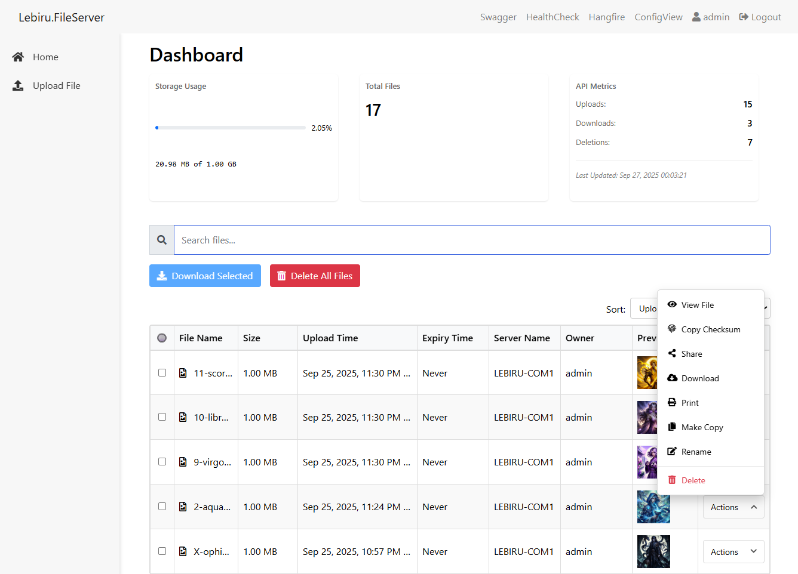

# Lebiru.FileService

Lebiru.FileService is a simple ASP.NET Core application that allows users to upload, download, and manage files. It provides a RESTful API for file operations and includes a web interface for easy interaction.

## Features

- **Secure Authentication**: 🔒 Admin authentication required to access all features and endpoints.
- **File Upload**: Users can upload files to the server.
- **File Download**: Users can download files from the server.
- **Multi-File Download to Zip**: Users can download multiple files into a zip from the server. (@alfcanres)
- **File Listing**: Users can view a list of uploaded files along with their upload times.
- **Image Preview**: 🖼️ Image files are displayed with a preview in the web interface.
- **Text File Preview**: 📄 Text files show the first 100 characters as a preview in the web interface.
- **File Expiry**: ⏳ Set expiration times for uploaded files (1 minute, 1 hour, 1 day, 1 week, or never).
- **Background Jobs**: 🔄 Automated cleanup of expired files using Hangfire.
- **Job Monitoring**: 📊 Hangfire dashboard for monitoring file cleanup and expiry jobs.
- **Console Logging**: 📝 Detailed logging of file deletions and cleanup operations.
- **Dark Mode**: 🌙 Toggle between light and dark themes for better visibility.

## Technologies Used

- **ASP.NET Core**: Backend framework for building web applications and APIs.
- **C#**: Programming language used in conjunction with ASP.NET Core.
- **HTML/CSS/JavaScript**: Frontend technologies for building the web interface.
- **Swagger**: API documentation tool used to document the RESTful API endpoints.
- **OpenShift**: Platform used for horizontal scaling and deployment of the application.
- **OpenTelemetry**: Unified data telemetry for microservices
- **Jaeger**: Open source, distributed tracing platform
- **Hangfire**: Background job processing for scheduled tasks
- **Hangfire.Console**: Enhanced logging for background jobs

## Getting Started

To run the application locally, follow these steps:

1. **Clone this repository** to your local machine.
2. **Open the solution** in Visual Studio or your preferred IDE.
3. **Build the solution** to restore dependencies.
4. **Run the application** using the IDE's built-in tools or command-line interface.
5. **Access the application** through the provided URL (e.g., `http://localhost:port`).

## API Documentation

The API documentation is available through Swagger. Once the application is running, you can access the Swagger UI by navigating to `/swagger` in your browser.

## Usage

### Authentication

- The application requires authentication for all features
- An admin password is automatically generated at startup and displayed in the console
- Login using the username `admin` and the generated password
- All API endpoints and web interfaces require authentication

### File Operations

- **Uploading Files**: 
  - Use the web interface or send a POST request to `/File/CreateDoc` with the file attached as form data
  - Set expiry time during upload (1 minute, 1 hour, 1 day, 1 week, or never)
  - Files are automatically deleted when they expire
- **Downloading Files**: 
  - Click the download link in the web interface or send a GET request to `/File/DownloadFile?filename=your_file_name`
  - Batch download multiple files as a ZIP archive
- **File Management**:
  - View list of all uploaded files with upload times and expiry status
  - See remaining time before file expiry
  - Automatic cleanup of expired files
  - Monitor file operations through Hangfire dashboard at `/hangfire`
- **User Interface**:
  - Image previews for supported formats (PNG, JPG, GIF, BMP)
  - Click previews to view full-size images
  - Toggle dark mode for comfortable viewing
  - Search and filter files

## Deployment

The application can be deployed to OpenShift for horizontal scaling and high availability. Configure your OpenShift environment and deploy the application using the provided deployment configurations.

## Contributing

Contributions are welcome! If you have any ideas, improvements, or bug fixes, feel free to open an issue or submit a pull request.

## License

This project is licensed under the MIT License - see the [LICENSE](LICENSE) file for details.

